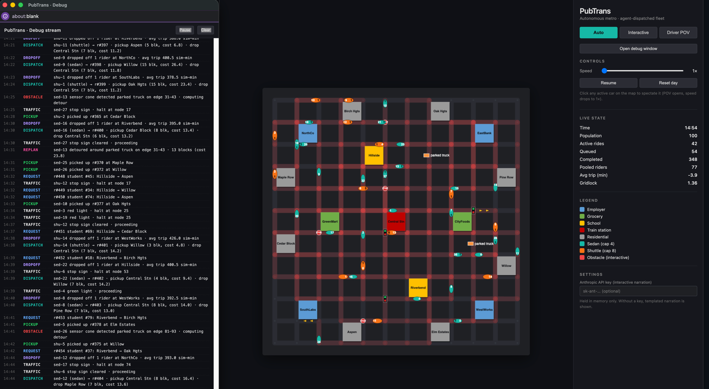
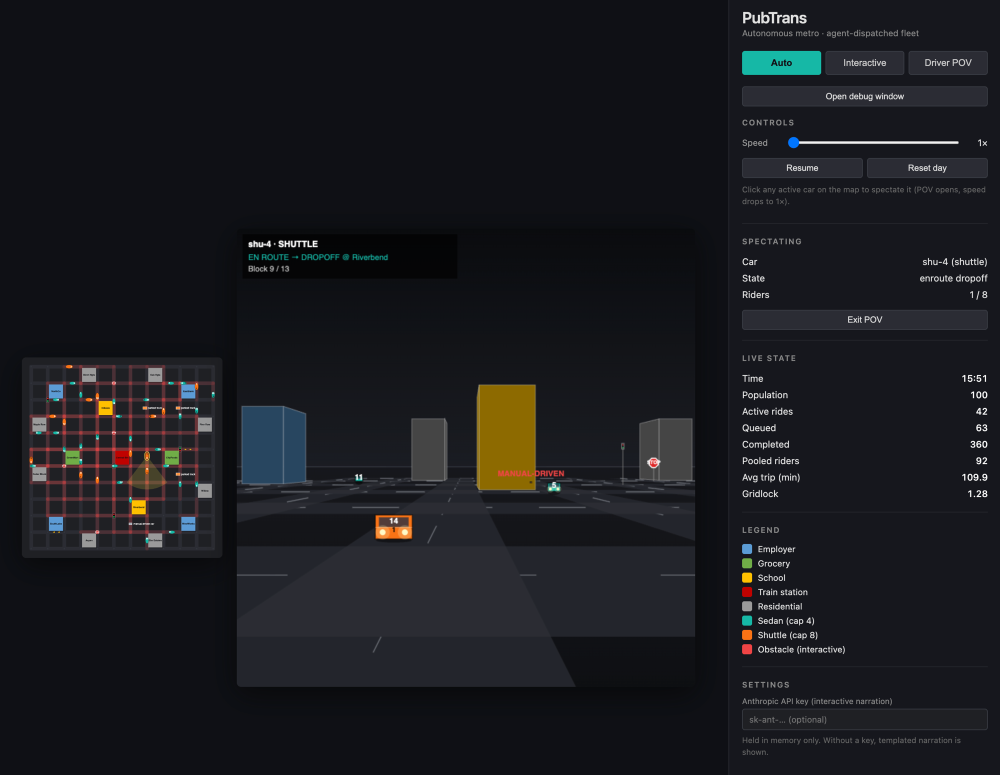
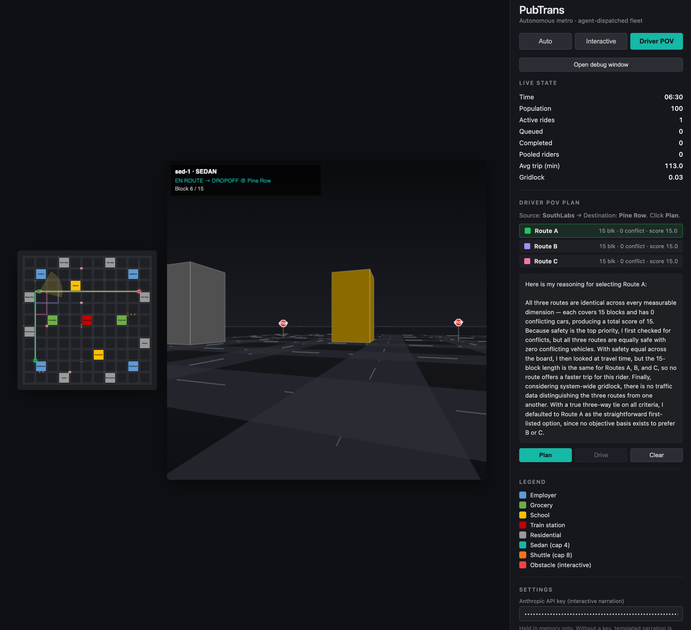

# pubtrans_solved

A 2D/3D simulation of a small metro area served by an LLM/agent-controlled fleet of autonomous vehicles (sedans + shuttles). 

Goal: Demonstrate how autonomous driving/routing algorithms can & will work. Note this runs all in browser, so the simulation is small & simple

Single-file HTML + Canvas + vanilla JS. no build step, package manager, dependencies.

## View it live

Once GitHub Pages is enabled for this repo, the app runs in the browser — no install:

**https://jsherman999.github.io/pubtrans_solved/**

(The core simulation runs entirely client-side. The optional LLM narration needs an Anthropic API key pasted into the Settings panel — see [Optional: LLM narration](#optional-llm-narration).)

## Screenshots

Auto mode in flight, with the debug window open streaming dispatch, pickup, drop-off, traffic, and obstacle events. Each car is an oval aligned with its travel direction — the white number at the leading edge is the car number (matches the `sed-N` / `shu-N` ids in the debug stream), the black number behind it is the current passenger count. Two parked trucks are visible on the curbs:



Spectate — clicked shuttle `shu-4` on the grid and the FPV opened alongside a mini-map; sim continued at 1×. The HUD reads `EN ROUTE → DROPOFF @ Riverbend` and a `MANUAL-DRIVEN` obstacle (a non-fleet car) is sitting in the lane ahead. Sidebar's Spectating panel shows the focal car, its state, and rider count:



Driver POV mode mid-trip — three candidate routes drawn on the mini-map (Route A highlighted green), Claude Sonnet 4.6 narration in the sidebar explaining the tiebreaker that selected Route A despite a three-way tie on the headline metrics, and the FPV showing the trip in progress with `EN ROUTE → DROPOFF @ Pine Row`:



## Install & run

```bash
git clone https://github.com/jsherman999/pubtrans_solved.git
cd pubtrans_solved
```

Then open `index.html` in a modern browser. Use whichever is easiest for your OS:

| OS | Command |
|---|---|
| macOS | `open index.html` |
| Linux | `xdg-open index.html` |
| Windows | `start index.html` |
| Any | double-click `index.html` in your file manager |

Tested in current Chrome, Safari, Firefox, and Edge. The whole app is in `index.html` (~2500 lines).

### Optional: LLM narration

In Interactive and Driver POV modes the app can call **Claude Sonnet 4.6** to narrate the dispatcher's reasoning in plain English. Paste an Anthropic API key into the **Settings** panel in the sidebar; the key is held in memory only and a page refresh clears it. Without a key, a templated explanation is shown. The call goes directly from the browser to `api.anthropic.com` using the `anthropic-dangerous-direct-browser-access` header — no proxy server needed.

## What the simulation does

- **City**: 12×12 intersection / 11×11 block grid with 4 employers, 2 schools, 2 grocery stores, 1 train station, and 8 residential clusters
- **Population**: 100 simulated humans across 4 profiles (worker / student / errand-runner / commuter), each with a randomized daily schedule that generates ride requests at the appropriate times
- **Fleet**: 28 sedans (capacity 4) + 14 shuttles (capacity 8). The dispatcher pools concurrent same-destination requests into shuttles
- **Routing**: Dijkstra on the street graph with edge weights = `1 + congestion_penalty × claims`, so cars naturally spread across alternates
- **Traffic infrastructure** (randomized at init time): 2 one-way streets (Dijkstra respects direction), 4 stoplights with cycling phases, 4 stop signs

## Three modes

**Auto** — a sped-up simulated day. The city hums with cars satisfying schedule-driven demand. HUD shows active rides, completed rides, average trip time, and a live gridlock score. Random obstacles (jaywalkers, parked trucks, manual-driven cars) spawn on the grid and every car senses and reacts with kind-specific behaviors: jaywalker brake-and-wait, truck detour, manual-driven car slow-follow. Scheduled surge events (school day starts/ends, train arrivals/departures) inject bursts of requests with a banner announcement in both the top-down and FPV views. **Click any active car** on the grid to spectate it — a wireframe POV opens for that car alongside a mini-map and the sim continues at 1×. Click another car to switch; **Exit POV** returns to full-map view.

**Interactive** — click a source then destination on the map. The agent's decision is walked through step-by-step: candidate routes (k-shortest with edge-banning to find alternates), per-route conflict analysis, chosen route, then a simulated trip with scripted obstacles demonstrating sensor avoidance and on-the-fly replan.

**Driver POV** — same source/destination flow as Interactive, but during the drive the canvas splits into a small top-down mini-map (with the focal car highlighted and its view cone shown) and a wireframe first-person view from inside the car. Roads with lane stripes, building faces shaded by distance, other cars in the fleet at their real positions (right-lane biased with direction-aware head/taillights), scripted obstacles, stoplights, stop signs, and one-way arrows are all projected from the car's perspective. When the sensor cone trips, the FPV shows a red BRAKE overlay; the route then replans (for parked trucks) or continues after the jaywalker clears.

## Debug stream

A debug panel is **docked under the grid** and streams every behind-the-scenes decision in real time from the moment the app loads (the sim starts at 1× — the slowest speed — so the events are easy to follow). Use its **Pause** / **Clear** controls inline, or click **Pop out debug window** in the sidebar to mirror the same stream into a separate browser window:

| Category | Fires when |
|---|---|
| `REQUEST` | A scheduled human or a surge event enqueues a ride |
| `DISPATCH` | Sedan assigned to a single rider |
| `POOL` | Shuttle pools 2+ riders going to the same destination |
| `PICKUP` / `DROPOFF` | Car arrives at pickup or completes a drop-off |
| `PLAN` | Interactive plan: candidate routes with blocks / conflicts / scores |
| `OBSTACLE` | An obstacle is spawned or sensed by a car |
| `REPLAN` | Detour computed, jaywalker cleared, or slow-follow resumed |
| `TRAFFIC` | Car stops at or proceeds through a stoplight or stop sign |
| `EVENT` | A scheduled surge event fires |
| `SYSTEM` | Spectate start/exit, debug window open |

Pause / Clear controls live in both the docked panel and the popped-out window (they stay in sync). Buffer caps at 500 entries.

## See also

- [`Prompt`](./Prompt) — original problem statement
- [`PLAN.md`](./PLAN.md) — architecture and build steps
